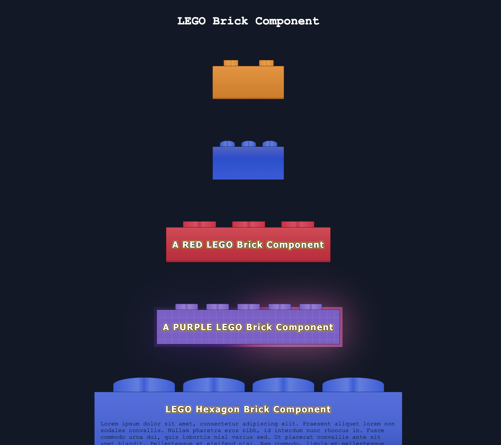

# LEGO Brick React Component

## Description
A customizable React component that creates visually appealing LEGO-style brick elements. This component uses advanced CSS/SASS techniques to achieve an authentic LEGO brick appearance, complete with realistic lighting effects and customizable colors, studs, patterns, and text.



## Technologies
- React 19
- TypeScript
- Vite
- SASS/SCSS
- CSS Custom Properties: Houdini API

## Features
- Authentic LEGO brick appearance with 3D effects
- Customizable colors using CSS variables
- Dynamic lighting effects using CSS gradients
- Fancy text option with golden shadow effects
- Responsive design
- TypeScript support for type safety
- Easy integration with existing React projects

## Implementation
The component uses advanced CSS/SASS techniques to create the LEGO brick appearance:
- CSS Custom Properties (variables) for dynamic color management
- Linear gradients for realistic lighting effects
- Pseudo-elements for creating the brick's 3D structure
- Text shadow effects for enhanced visibility
- Color mixing using modern CSS color-mix function

## Usage
```tsx
// Basic usage
<LegoWrapper id="first-brick" />

// Custom color and fancy text
<LegoWrapper
  color="purple"
  fancyText={true}
  title="LEGO Brick Component"
  id="example-brick"
  text="Your content here"
/>


// Custom color, fancy text, dynamic stud count, and pattern
<LegoWrapper
  color="purple"
  fancyText={true}
  title="LEGO Brick Component"
  id="example-brick"
  text="Your content here"
  studCount={5}
  pattern='grid'
/>
```

## Props
- `color`: String - Sets the brick's color (e.g., 'purple', 'red', 'green')
- `fancyText`: Boolean - Enables golden shadow effect on text
- `title`: String - Sets the brick's title
- `id`: String - Unique identifier for the brick
- `text`: String - Content text for the brick
- `studCount`: Number - Sets the number of studs on the brick
- `studShape`: String - Sets the shape of the studs (e.g., 'round', 'square', 'hexagon')
- `studDimensions`: Object - Sets the width and height of the studs (e.g., { width: 20, height: 15 })
- `pattern`: String - Sets the brick's pattern (e.g., 'standard', 'smooth', 'grid')

## Development
```bash
# Install dependencies
npm install

# Start development server
npm run dev

# Build for production
npm run build
```

## License
MIT License
